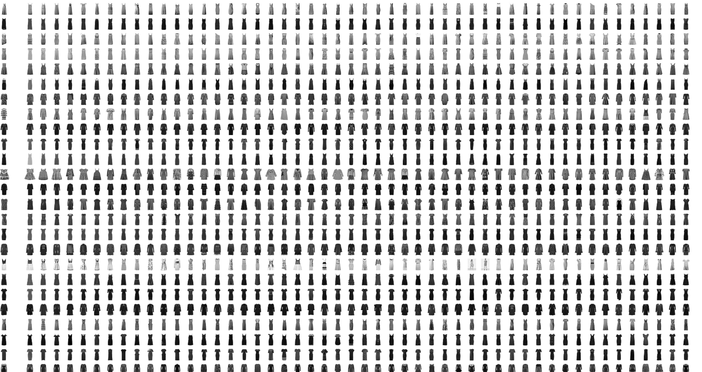

<!-- START doctoc generated TOC please keep comment here to allow auto update -->
<!-- DON'T EDIT THIS SECTION, INSTEAD RE-RUN doctoc TO UPDATE -->
**Table of Contents**

- [Run the Hello World exyample using query language](#build-your-first-neural-search-app)
  - [🗝️ Key Concepts](#-key-concepts)

<!-- END doctoc generated TOC please keep comment here to allow auto update -->

# Run the Hello World exyample using query language

## 🗝️ Key Concepts

First of all, read up on [Jina 101](https://github.com/jina-ai/jina/tree/master/docs/chapters/101) so you have a clear understanding of how Jina works. We're going to refer to those concepts a lot. We assume you already have some knowledge of Python and machine learning.

This is an extension of the Hello World example, but here we use QueryLanguage to filter the results by category.
### Install Requirements

In your terminal:

```
pip install -r requirements.txt
```


## 🏃 Run the Flows

Now that we've got the code to load our data, we're going to dive into writing our app and running our Flows!

### Index Flow

First up we need to build up an index of our file. We'll search through this index when we use the query Flow later.

```bash
python app.py index
```

### Search Flow

Run:

```bash
python app.py query
```

## Results

This is an example of the results after query.





